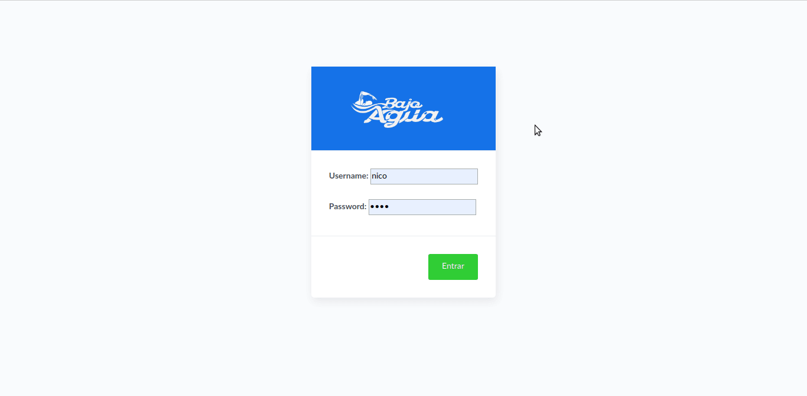

# Training Tracker
This is a web application developed in Django. 

## Some context
I belong to an open water swimming training group. Since the COVID-19 pandemic quarantine began, we could no longer train in the club pool because it was closed, and we also could not meet in person for dry training. We started sending out training routines by chat, but it was difficult to follow up. Over time, the training sessions began to slow down, causing members to lose the fitness they had achieved after several months of hard training. That's why I set a goal of doing an MVP in 20 hours to try to solve my group's situation. 

## Goal
The main goal is to help sharing training routines in training groups, as well as to facilitate their tracking by both group members and the trainer.

Using this application you will be able to:
- Create training routines with your description and a link to a youtube video.
- Track your workout, uploading the time you spend on each routine. 
- Have a wide overview of your workout through the control panel on the home page. 
- Track the training of your students.

## Preview

## Setting up

### Pre-requisites
- Python 3.7 or later
- Pipenv

### Start and configure local env
    $ pipenv shell
    $ pipenv install
    
### Migrate models and create superuser

    $ pipenv run python manage.py migrate
    $ pipenv run python manage.py createsuperuser

## Using

### Running server

    $ pipenv run python manage.py runserver
   
